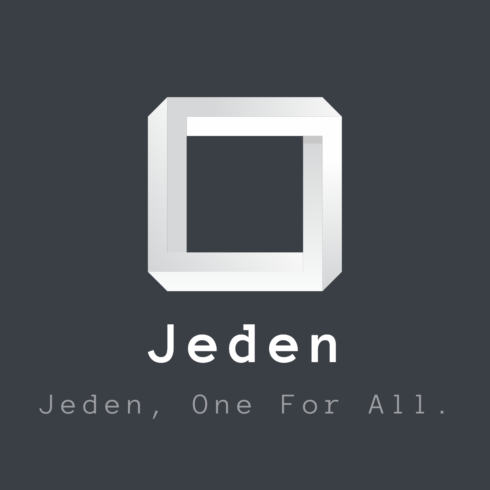

# Reto 2 Agencia de publicidad

## Aplicación

* Index
  * Buscar anuncios por el buscador o seleccionando una subcategoria.
  * Iniciar sesión.
  * Consultar mis anuncios, publicar un anuncio, editar nuestro perfil (Necesitas estar logueado).
* Busqueda
  * Visualizar todos los anuncios que coincidan con la búsqeda realizada.
  * Filtrar los anuncios por titulo o nombre de usuario.
  * Si clicamos en un anuncio nos enviará a otra página para ver más informacioón sobre este
* Anuncio 
  * Podremos ver más información sobre el anuncio elegido.
  * Contactar con el anunciante del producto.
  * Visualizar products que tienen relación con el producto.
* Mis anuncios
  * Visualizar todos los anuncios del usuario publicados.
  * Modificar y eliminar cualquier producto publicado.
* Login y Registro
  * Hacer una petición para creación de cuenta a Ajebask.
  * Iniciar sesión.
  * Si necesitamos ayuda podremos ir al link del footer.

## Descarga de la aplicación 

## Desarrolladores y redes sociales
Aplicación creada por los desarrolladores del equipo Jeden:
  * [Jon Santos](https://github.com/Santoxjon)
  * [Eric Muñoz] (https://github.com/EricMunozFernandez)
  * [Miguel Barros] (https://github.com/miguelbarrosv)
  
Redes sociales de Jeden :
  * [Twitter] (https://twitter.com/Jeden__)
  * [Github] (https://github.com/jeden-one)
  
## Soporte 
Para cualquier incidencia relacionada con la aplicación no dudes en contactar con el equipo de Jeden a través del correo
jeden.egibide@gmail.com
